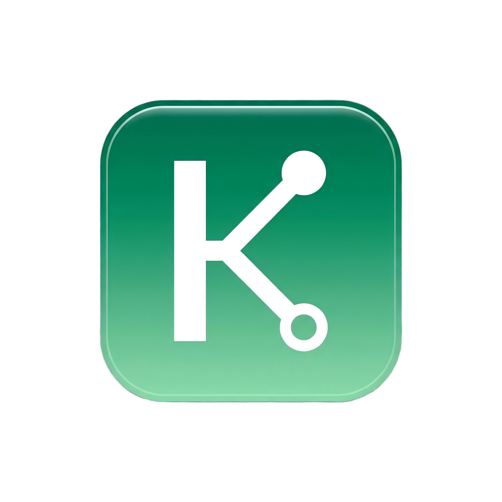

# KunyaoGit

<p align="left">
  
</p>

> 一个跨平台 Git 桌面客户端（Windows / macOS / Linux），深度集成 **GitHub** 和 **Gitee**（码云）。

    

## 特性

### 🛠 基础 Git 操作
- 本地仓库：打开 / 克隆 / 初始化
- 文件状态查看、暂存、取消暂存、丢弃修改
- 提交、推送、拉取、Fetch
- 分支管理：创建、切换、删除、合并
- 提交历史时间线（含 Tag / 分支引用标记）
- Stash 暂存
- 冲突解决：一键 ours / theirs
- **拖拽上传本地文件 / 文件夹**（自动保留目录结构 + `git add`）

### 🌐 远程仓库管理（GitHub + Gitee）
- 仓库列表、过滤、搜索
- **在线浏览 / 编辑 / 新建 / 删除远程仓库文件**（直接调 Contents API）
- 浏览器中跳转
- 完整的 OAuth Token 安全存储（electron-store）

### 📂 源代码浏览与编辑
- 文件树（可展开、过滤）
- 暂存 / 未暂存变更查看（diff 视图，并排 / 统一两种模式）
- **Monaco Editor**（VS Code 同款）做代码查看 / 编辑
- 文件保存即暂存，可一键「提交并推送」

### 🏷 发布版本管理
- 创建 Tag + GitHub Release（支持草稿、预发布）
- **自动从 commits 生成 CHANGELOG**（遵循 Conventional Commits）
- 查看 / 删除历史 Release
- 附件管理

### 🔄 自动更新检查
- 启动后 1.5 秒静默检查 GitHub + Gitee 最新 release
- 发现新版本时弹窗提示，支持「打开下载页 / 忽略此版本」
- 主进程做 6 小时节流，避免频繁请求
- 在 设置 → 关于 中可手动「检查更新」，查看 release notes
- **★ 应用内自动更新**（v0.2.2）：弹窗内直接「立即下载并安装」，多源下载（Gitee 优先 / GitHub 兜底）带实时进度条，下载完成自动启动安装包并退出应用

### ⚙️ 其他
- 双平台 Token 一站式管理
- 自定义 Git 可执行路径
- 暗色主题
- 多语言基础（中文优先）
- **专属应用图标**（Jade 绿 + K + Git 分支节点）

## 截图

> 截图待补充

## 安装

### Windows（推荐）
从 [Releases](https://github.com/buxiaju/KunyaoGit/releases) 下载最新版 `KunyaoGit-Setup-0.2.3-x64.exe` 双击安装（NSIS 安装包，~86 MB，含完整 Electron 运行时 + 专属图标，创建桌面和开始菜单快捷方式）。

- GitHub: https://github.com/buxiaju/KunyaoGit/releases/download/v0.2.3/KunyaoGit-Setup-0.2.3-x64.exe
- Gitee:  https://gitee.com/buxiaju/KunyaoGit/releases/v0.2.3 （在 `.release-assets/` 目录获取安装包）

便携版（不需安装）见同 Release 的 `KunyaoGit-portable-v0.2.3.zip`（~3.5 MB，解压后运行 `kunyaogit.exe`，需本机已安装 Node.js）。

### 自动更新
安装后启动时会自动检查新版本，发现新版本后弹窗提示，可在弹窗内直接「立即下载并安装」（多源下载带进度条，下载完成自动启动安装包）。也可选择「打开下载页 / 忽略此版本」。如关闭了自动检查，可在 设置 → 关于 中手动「检查更新」。

### 系统要求
- Windows 10 / 11（x64）
- 已安装 Git（应用通过本地 Git 命令行调用，需要 `git` 在 PATH 中）

### 从源码运行
需要 Node.js ≥ 20、Git ≥ 2.30。

```bash
git clone https://github.com/buxiaju/KunyaoGit.git
cd KunyaoGit
npm install
npm run dev     # 开发模式（带热更新）
```

### 自己打包
```bash
npm run build:win   # 产出 release/KunyaoGit-Setup-0.2.3-x64.exe
```

## 配置 GitHub / Gitee Token

1. 打开 KunyaoGit → 设置
2. 选 GitHub 或 Gitee 标签
3. 填入 Personal Access Token（**最小权限**）
4. 点「测试并保存」

### GitHub Token 权限建议
- `repo`（私有仓库需要）
- `read:user`
- 不需要 `admin:org`、`delete_repo` 等敏感权限

### Gitee Token 权限建议
- `projects`、`pull_requests`、`issues`

## 技术栈

- **运行时**：Electron 33
- **UI**：React 18 + TypeScript 5 + Vite 6
- **样式**：Tailwind CSS 3
- **状态**：Zustand
- **Git**：[simple-git](https://github.com/steveukx/git-js) 封装本地 Git CLI
- **GitHub API**：[@octokit/rest](https://github.com/octokit/rest.js)
- **Gitee API**：axios 直连官方 REST API v5
- **编辑器**：[Monaco Editor](https://github.com/microsoft/monaco-editor)（VS Code 同款）
- **Diff**：自实现 unified diff 解析 + 并排 / 统一渲染
- **打包**：[electron-builder](https://www.electron.build/)（NSIS 安装包）

## 项目结构

```
KunyaoGit/
├── electron/             # 主进程
│   ├── main.ts           # 窗口 + IPC 注册
│   ├── preload.ts        # contextBridge 安全 API
│   ├── ipc/              # IPC 处理器（按域拆分）
│   └── services/         # 业务服务（Git 封装 / 配置 / 更新检查）
├── src/                  # 渲染进程
│   ├── components/       # 通用 + 仓库相关组件
│   ├── pages/            # 路由页面
│   ├── stores/           # Zustand 状态（repo / settings / update）
│   ├── hooks/            # 自定义 hooks（更新检查等）
│   └── styles/           # Tailwind 入口
├── shared/               # 渲染+主进程共享类型和 IPC 通道常量
├── docs/                 # 项目文档（功能说明 / API 参考 / 安装 / 用户指南 / 开发指南）
├── scripts/              # 打包 / 发布 / 调试脚本
├── assets/               # 应用图标
├── ARCHITECTURE.md       # 架构与维护手册（接手者必读）
├── CONTRIBUTING.md       # 贡献指南
└── ...
```

> 更详细的结构说明见 [`ARCHITECTURE.md`](./ARCHITECTURE.md)，开发者文档见 [`docs/`](./docs/)。

## 路线图

- [x] 基础 Git 操作
- [x] GitHub / Gitee 双平台集成
- [x] Monaco Editor 代码编辑
- [x] 远程文件浏览 / 编辑
- [x] 拖拽上传
- [x] Release 管理
- [x] 自动更新检查（GitHub + Gitee 双源）
- [x] 应用内自动更新（下载 + 安装，v0.2.2）
- [ ] 子模块管理
- [ ] SSH key 管理
- [ ] Git LFS 支持
- [ ] 全局搜索
- [ ] macOS / Linux 打包
- [ ] 多语言（i18n）

## 贡献

欢迎提 Issue / PR，贡献流程与规范见 [`CONTRIBUTING.md`](./CONTRIBUTING.md)。

## 许可

MIT
